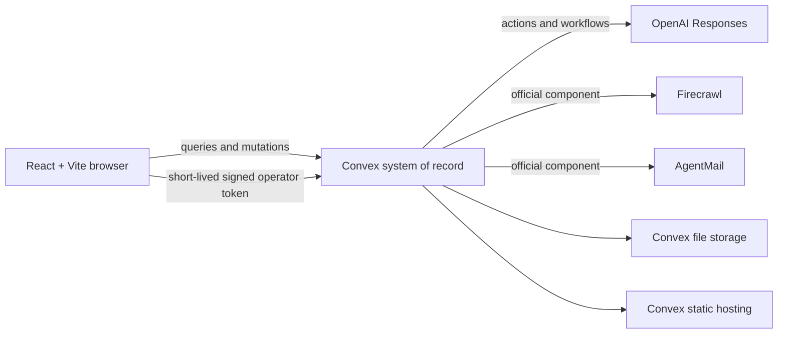

# MakerMesh architecture

This document distinguishes the approved target architecture from integrations that have
already been exercised. See `hackathon.md` for evidence-backed implementation status.

## System boundary

There is no separate application server, database, cache, queue, object store, or realtime
gateway.

The current cloud target is the development deployment `disciplined-ladybug-82`; its
sanitized fixture frontend is served through the static-hosting component at
`https://disciplined-ladybug-82.convex.site`. No production deployment exists yet.

## Frontend

- React 19, TypeScript strict mode, Vite, React Router.
- Convex React subscriptions for reactive application state.
- Tailwind CSS with MakerMesh custom properties and bespoke Radix primitives.
- Motion for short state transitions and screen comprehension.
- Zod at provider and browser input boundaries.

## Convex modules

- Public queries expose only sanitized project and source views.
- Public mutations are limited to bounded anonymous demo overlays and capped brief work.
- Privileged queries, mutations, and actions independently validate the signed operator identity.
- External APIs run only in actions or mounted components.
- Scheduled functions continue extraction, parsing, expiry, and bounded retries.
- `@convex-dev/rate-limiter` protects operator login and public API budgets.
- Firecrawl and AgentMail retain their provider-specific durable state in the official components.

## Application tables

- `projects`, `briefs`, `requirements`
- `supplierEntities`, `projectSuppliers`, `supplierAliases`
- `sources`, `capabilityClaims`, `discoveryRuns`
- `outreachDrafts`, `mailThreads`, `quotes`
- `activityEvents`, `usageEvents`
- `passportPreviews`, `demoBaselines`
- `demoSessions`, `demoSessionState`, `demoRequirementOverrides`, `demoSessionEvents`
- `externalOperations`, `requirementEvaluations`, `productEvents`
- Convex Auth tables, `operatorProfiles`, `idempotencyRecords`

Every user-facing list has a matching index. Time-ordered tables include project and time
in the index, and no potentially unbounded path uses a full-table scan.

## Immutable baseline and visitor overlay

One sanitized captured-live snapshot supplies evidence, provider events, and the
fictional email loop. An anonymous session stores only its replay cursor, selected maker,
viewed evidence, approved demo steps, comparison weights, and presentation preference.
The overlay expires after 24 hours. Resetting a demo clears or replaces only that overlay.
Session creation uses a generous replenishing safety budget. If that budget or the local
session backend is unavailable, the browser transparently labels and uses the captured
fixture fallback so judges can still inspect the complete product without provider calls.

## Operator authentication

Convex Auth supplies a custom credentials provider named `operator-code`. The provider
compares the submitted secret against a salted PBKDF2 verifier held only in Convex
environment configuration. Attempts are rate limited before expensive verification.
Short-lived signed Convex Auth tokens are the approved equivalent signed-session
mechanism for a Vite SPA; a custom HttpOnly cookie would not authenticate Convex's
reactive WebSocket functions.

An indexed `operatorProfiles` record holds only role and disabled state. Every privileged
query, mutation, and action independently calls `requireOperator`; components receive no
implicit app authorization. No operator secret or verifier appears in Vite variables or
client bundles.

## External workflow

1. The server derives a scoped key and content hash from the current approved brief.
2. Firecrawl search and durable crawl write progress and usage events.
3. OpenAI receives only relevant excerpts and returns a strict schema.
4. Internal mutations persist deduplicated entities, sources, and evidence claims.
5. Approved outreach is capped at three allowlisted recipients and moves the project to awaiting replies.
6. Configured inbox ID plus message ID deduplicates signed AgentMail callbacks.
7. Project, brief, draft, message ID, source hash, and parser version scope OpenAI reply parsing.
8. Deterministic metrics recalculate in the same controlled continuation.

## Provenance

Claims store the source or message reference, exact excerpt, source-content hash,
observation time, acquisition method, evidence state, model, and prompt version. Quotes
retain field-level exact excerpts. AI confidence describes extraction confidence only and
never changes evidence state.

## Security and privacy

- Real recipient addresses exist only in private Convex/provider state.
- Public snapshots replace addresses, thread IDs, message IDs, and provider references.
- Real suppliers are not publicly scored or assigned negative qualification labels.
- External actions are bounded, cached, idempotent, timed out, and explicitly initiated.
- Operation scopes carry attempts and leases; stale attempts cannot persist results.
- Scheduled reply actions carry their expected attempt and atomically claim queued work,
  preventing delayed jobs from adopting a newer retry.
- Inbound mail is quarantined unless inbox, thread, sender, draft, project state, and current
  brief all match.
- Raw private application copies target 30-day retention; compact permitted evidence and
  sanitized snapshots may remain longer.
